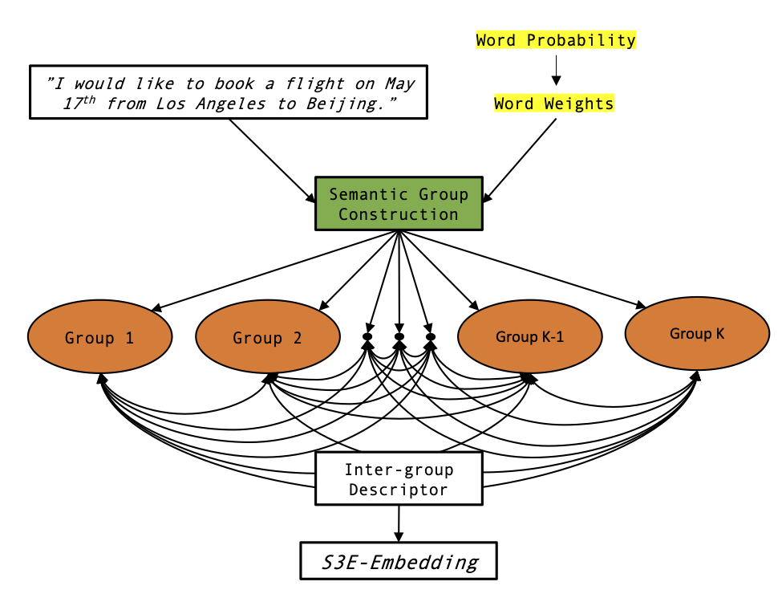
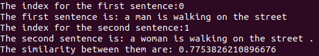

# S3E: Efficient Sentence Embedding via Semantic Subspace Analysis
<p align="center">

</p>

S3E provides a way to generate sentence embedding from static word embeddings. It contains three step: semantic group construction, intra-group descriptor and inter-group descriptor. We provide the source code for generating your own sentence embedding.


| Section | Description |
|-|-|
| [Installation](#Installation) 			| How to setup the environment  	|
| [Quick Usage Guide](#Quick-Usage-Guide)	| A quick guide 					|
| [Citation](#Citation)						| Reference Link		   		 	|


## Installation
We are using Python 3.7.

**Create a new environment**
```
conda create -n S3E python=3.7
conda activate S3E
```

**Install the dependencies**

```
conda install numpy
conda install -c anaconda scikit-learn
```

**Download Pretrained Word Embedding**

The files can be download from [Google Drive](https://drive.google.com/drive/folders/1aGhxhXtW9dGYbu85e3Z77L-RDTJe5kAr?usp=sharing)

Place the word embeddings into folder 'word_embedding' in order to work properly.


## Quick Usage Guide

To run the example code, simply run
```
python s3e.py --cluster_num 10
```

It did the following several things:
- Load word embedding and sentence txt.
- Sentence txt is given by custrev.pos.
- Perform S3E method and generate embedding.
- You can test the similarity of two sentences by giving sentence index in the txt file.
- Example:

<p align="center">

</p>


## Citation

If you find our model is useful in your research, please consider cite our paper: [Efficient Sentence Embedding via Semantic Subspace Analysis]():

``` 
@article{S3E,
    title = {Efficient Sentence Embedding via Semantic Subspace Analysis},
    author = {xx},
    journal={arXiv preprint arXiv:2002.xx},
    year={2020}
}
```

Contact person: Bin Wang, bwang28c@gmail.com

http://mcl.usc.edu/
